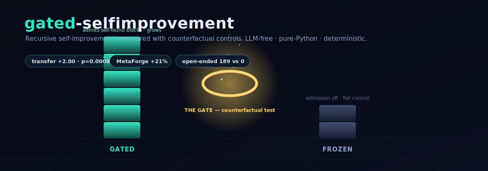

<p align="center">
  
</p>

<h1 align="center">gated-selfimprovement</h1>

<p align="center">
  <b>Recursive self-improvement, measured with counterfactual controls.</b><br>
  LLM-free · pure-Python standard library · deterministic · every gain gated against a matched control.
</p>

<p align="center">
  <a href="https://deepwiki.com/sunghunkwag/gated-selfimprovement"></a>
</p>

<p align="center">
  <a href="LICENSE"></a>
  
  
  
</p>

---

## What this is

Most "recursive self-improvement" (RSI) projects **assert** a result. This one **measures**
it — and reports the nulls as loudly as the wins. Every claimed improvement must pass a
**counterfactual gate**: it has to help *at equal compute, on held-out tasks, with identical
random streams*, versus a matched control that is denied exactly the one mechanism under test.
No neural networks, no API calls — the engines are pure Python that runs offline and reproduces
bit-for-bit.

The animated banner above shows the one-picture idea: two arms run the **same** improvement
loop. The **GATED** arm may admit building blocks it discovers about itself; the **FROZEN** arm
cannot. The gap between them — never the raw number — is the evidence. (A fully interactive 3D
version — drag to orbit, click the result orbs — is in `index.html`; open it in any browser.)

## Results at a glance

| Experiment | Headline | Control | Significance |
|---|---|---|---|
| **Compounding RSI** (repaired mechanism) | 5 recursive rounds beat 1 round at 5× compute, **+1.55 tasks** | vs equal-compute single round | p < 1e-4, **n = 100** (two environments) |
| **MetaForge counterfactual** (full budget) | searcher self-upgrades v0→v3, solves **19 → 23** | frozen searcher: flat 19 for 8 waves | **+21%**, matched tasks/budgets/seeds |
| **Open-ended loop** (4,444 generations) | **189** certified beyond-base behaviours | admission-disabled arm: **0**, forever | exact catalog membership |
| **Turing-complete substrate** (branches + loops) | **15** counterfactually-gated macros; solves held-out `reverse` | control arm: **0** macros | 8 seeds, offline VM |
| **Cross-substrate transfer** | a self-found skill unlocks a substrate that can't express it, **+2.00 tasks** | vs no-transfer and random-capability | transfer p = 0.0008; learning p = 0.014 |
| **Gate integrity (SDT)** | maps the 3 ways a self-modifying gate fails | 4 ablation arms, n = 40 | closed→vacuous, self-editable→wirehead |

**Honest boundaries (also measured, not hidden):** the repaired chain compounds but does *not*
beat the untrained baseline (the container's ceiling); the meta-RL grid is a full null; open-ended
growth is linear, not accelerating, and eventually hits a *search-dilution* wall; cross-substrate
transfer is behavioural, and deep *composition* of a transferred skill is limited by its I/O
interface. Details in the `results/*_RESULTS.md` files.

## The core discipline

- **Counterfactual gating** — a mechanism is credited only if an otherwise-identical arm that
  lacks it does worse, at equal budget and identical PRNG streams.
- **Held-out evaluation** — tasks the improver never trained on; source/target pool splits.
- **Pre-registration + honest nulls** — predictions written before runs; negative and
  noise-floor results reported alongside positives.
- **Machine-checkable certificates** — novelty is exact set-membership against an enumerated
  behaviour catalog; ledgers are hash-chained; everything is deterministic and resumable.

## Quick start

```bash
# no dependencies — Python 3.8+ standard library only
python3 src/tforge.py selftest              # VM: branches, loops, halting, crash-safety
python3 src/transferforge.py run 1 11 300   # cross-substrate transfer (n=11)
python3 src/transferforge.py report
python3 src/omniforge.py selftest           # unified model: 4 engines on one substrate
python3 src/omniforge.py upgrade report2    # compounding-RSI battery report
```

Long-horizon batteries run on any free CPU box (or the Kaggle kernels
`experiments/kaggle/*_kaggle.py` / `experiments/kaggle/omniforge_full_battery.py`) — all offline, no GPU.

## Key files

| File | Role |
|---|---|
| `src/omniforge.py` | unified model: shared substrate + 4 search engines + meta-RL + RSI upgrade + a separate stack-VM RSI system |
| `src/tforge.py` | Turing-complete substrate (branches, data-dependent loops) |
| `src/openforge.py` | open-ended improvement loop (vocabulary growth + self-curriculum) |
| `src/transferforge.py` | cross-substrate skill transfer experiment |
| `src/rsi_upgrade.py` | the repaired compounding-RSI mechanism |
| `src/sdt_layer.py` | reflective-endorsement / gate-integrity experiment |
| `index.html` | the interactive 3D demo (open locally in any browser) |
| `results/*_RESULTS.md` | per-experiment write-ups; `results/logs/experiments_log.jsonl` raw records |
| `wiki/Home.md` … `wiki/FAQ.md` | wiki pages (architecture, methodology, reproducing, FAQ) |

## How to read a claim here

Pick any headline. Find its `results/*_RESULTS.md`. It will tell you: the exact contrast, the control it
was measured against, the budget both arms shared, the seed count, the permutation p-value, and
the boundary of what it does *not* show. If a claim can't survive that, it isn't in the table.

## License

[Apache-2.0](LICENSE). © 2026 Sung Hun Kwag. LLM-free by design; contributions welcome via issues/PRs.
